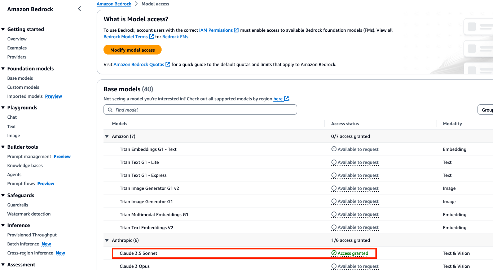
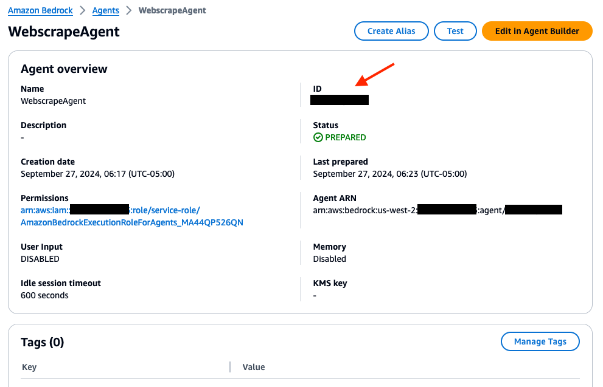

# Setup Amazon Bedrock Agent to Webscrape & Internet Search Using Natural Language

## Introduction
In this project, we will set up an Amazon Bedrock agent with two action groups. The first action group will enable the agent to web scrape a specific URL provided by the user, while the second action group allows the agent to perform an internet search based on a user query without requiring a URL.

For those who prefer an Infrastructure-as-Code (IaC) solution, we provide an AWS CloudFormation template to deploy all the necessary resources, including the Bedrock agent, action groups, and Lambda functions. If you prefer to deploy using AWS CloudFormation, please refer to the guide in the section below.

Alternatively, this README will guide you through the step-by-step process of setting up the Amazon Bedrock agent manually using the AWS Console.

## Prerequisites
- An active AWS Account.
- Familiarity with AWS services like Amazon Bedrock, and AWS Lambda.
- Access will need to be granted to the **Anthropic Claude Sonnet 3.5** model from the Amazon Bedrock console.
  
## Library dependencies
- [googlesearch-python](https://pypi.org/project/googlesearch-python/)
- [beautifulsoup4](https://pypi.org/project/beautifulsoup4/)


## Diagram


### Grant Model Access

- We will need to grant access to the models that will be needed for the Amazon Bedrock agent. Navigate to the Amazon Bedrock console, then on the left of the screen, scroll down and select **Model access**. On the right, select the orange **Enable specific models** button.


- To have access to the required models, scroll down and select the checkbox for the **Anthropic: Claude Sonnet 3.5** model. Then in the bottom right, select **Next**, then **Submit**.


- After, verify that the Access status of the Model is green with **Access granted**.




## Deploy resources via AWS Cloudformation for the Amazon Bedrock Agent:
*Here are the instructions to deploy the resources within your environment:*

***Step 1***

Download the Cloudformation templates from below, then deploy in order:

Click here to download template 1 🚀 - [1 - Agent-Lambda Stack](https://github.com/build-on-aws/bedrock-agents-webscraper/blob/main/cfn/1-bedrock-agent-lambda-template.yaml) 
- This next template will create an Amazon bedrock agent, action group, with an associated Lambda function.

Click here to download template 2 🚀 - [2 - EC2 UI Stack](https://github.com/build-on-aws/bedrock-agents-webscraper/blob/main/cfn/2-ec2-streamlit-template.yaml)
- This template will be used to deploy an EC2 instance that will run the code for the Streamlit UI.

***Step 2***

   - In your mangement console, search, then go to the CloudFormation service.
   - Create a stack with new resources (standard)

   

   - Prepare template: ***Choose existing template*** -> Specify template: ***Upload a template file*** -> upload the template downloaded from the previous step. 

  

   - Next, Provide a stack name like ***webscrape-agent***, then an alias. After, select Next.

   

   - On the ***Configure stack options*** screen, leave every setting as default, then go to Next. 

   - Scroll down to the capabilities section, and acknowledge the warning message before submitting. 

   - Once the stack is complete, follow the same steps to deploy the second template.


***Step 3***

### Testing the Bedrock Agent

- Navigate to the Bedrock console. Go to the toggle on the left, and under **Builder tools** select ***Agents***, then the `WebscrapeAgent-{Alias}` that was created.


- In the management console on the right, you have a test user interface. Enter prompts in the user interface to test your Bedrock agent.


- Example prompts for Action Groups:

    1.  Webscrape this url and tell me the main features of pikachu "https://www.pokemon.com/us/pokedex/pikachu".

    2. Webscrape this url and tell me the main villians that Goku had to fight on planet earth "https://en.wikipedia.org/wiki/Goku".

    3. Do an internet search and tell me the top 3 best traits about lebron james

    4. Do an internet search and tell me how do I know what foods are healthy for me


- If you would like to launch the Streamlit app user interface, refer to **Step 6** below to configure the EC2 instance.


## Step-by-step Setup for the Amazon Bedrock Agent

### Step 1: AWS Lambda Function Configuration

- Navigate to the AWS Lambda management console, and create a Lambda function (Python 3.12) for the Bedrock agent's action group. We will call this Lambda function `bedrock-agent-webscrape`. 


 
- Copy the provided code from [here](https://github.com/build-on-aws/bedrock-agents-webscraper/blob/main/function/lambda_webscrape.py), or from below into the Lambda function.


```python
import urllib.request
import os
import shutil
import json
from bs4 import BeautifulSoup

def get_page_content(url):
    try:
        req = urllib.request.Request(url, headers={'User-Agent': 'Mozilla/5.0'})
        with urllib.request.urlopen(req) as response:
            if response.geturl() != url:  # Check if there were any redirects
                print(f"Redirect detected for {url}")
                return None
            elif response:
                return response.read().decode('utf-8')
            else:
                raise Exception("No response from the server.")
    except Exception as e:
        print(f"Error while fetching content from {url}: {e}")
        return None

def empty_tmp_folder():
    try:
        for filename in os.listdir('/tmp'):
            file_path = os.path.join('/tmp', filename)
            if os.path.isfile(file_path) or os.path.islink(file_path):
                os.unlink(file_path)
            elif os.path.isdir(file_path):
                shutil.rmtree(file_path)
        print("Temporary folder emptied.")
        return "Temporary folder emptied."
    except Exception as e:
        print(f"Error while emptying /tmp folder: {e}")
        return None

def save_to_tmp(filename, content):
    try:
        if content is not None:
            print(content)
            with open(f'/tmp/{filename}', 'w') as file:
                file.write(content)
            print(f"Saved {filename} to /tmp")
            return f"Saved {filename} to /tmp"
        else:
            raise Exception("No content to save.")
    except Exception as e:
        print(f"Error while saving {filename} to /tmp: {e}")
        return None

def check_tmp_for_data(query):
    try:
        data = []
        for filename in os.listdir('/tmp'):
            if query in filename:
                with open(f'/tmp/{filename}', 'r') as file:
                    data.append(file.read())
        print(f"Found {len(data)} file(s) in /tmp for query {query}")
        return data if data else None
    except Exception as e:
        print(f"Error while checking /tmp for query {query}: {e}")
        return None

def handle_search(event):
    parameters = event.get('parameters', [])
    input_url = next((param['value'] for param in parameters if param['name'] == 'inputURL'), '')

    if not input_url:
        return {"error": "No URL provided"}

    if not input_url.startswith(('http://', 'https://')):
        input_url = 'http://' + input_url

    tmp_data = check_tmp_for_data(input_url)
    if tmp_data:
        return {"results": tmp_data}

    empty_tmp_result = empty_tmp_folder()
    if empty_tmp_result is None:
        return {"error": "Failed to empty /tmp folder"}

    content = get_page_content(input_url)
    if content is None:
        return {"error": "Failed to retrieve content"}

    cleaned_content = parse_html_content(content)

    filename = input_url.split('//')[-1].replace('/', '_') + '.txt'
    save_result = save_to_tmp(filename, cleaned_content)

    if save_result is None:
        return {"error": "Failed to save to /tmp"}

    return {"results": {'url': input_url, 'content': cleaned_content}}

def parse_html_content(html_content):
    soup = BeautifulSoup(html_content, 'html.parser')
    for script_or_style in soup(["script", "style"]):
        script_or_style.decompose()
    text = soup.get_text()
    lines = (line.strip() for line in text.splitlines())
    chunks = (phrase.strip() for line in lines for phrase in line.split("  "))
    cleaned_text = '\n'.join(chunk for chunk in chunks if chunk)

    max_size = 25000
    if len(cleaned_text) > max_size:
        cleaned_text = cleaned_text[:max_size]

    return cleaned_text


def lambda_handler(event, context):
    response_code = 200
    action_group = event['actionGroup']
    api_path = event['apiPath']

    print("THE EVENT: ", event)

    if api_path == '/search':
        result = handle_search(event)
    else:
        response_code = 404
        result = f"Unrecognized api path: {action_group}::{api_path}"

    response_body = {
        'application/json': {
            'body': result
        }
    }

    action_response = {
        'actionGroup': event['actionGroup'],
        'apiPath': event['apiPath'],
        'httpMethod': event['httpMethod'],
        'httpStatusCode': response_code,
        'responseBody': response_body
    }

    api_response = {'messageVersion': '1.0', 'response': action_response}
    print("action_response: ", action_response)
    print("response_body: ", response_body)
    return api_response
```


- This above code takes the url from the event passed in from the bedrock agent, then uses the **urllib.request** library to call, then scrape the webpage. The **beatifulsoup** library is used to clean up the scraped data. The scraped data is saved to the `/tmp` directory of the Lambda function, then passed into the response back to the agent. Review the code, then **Deploy** the Lambda before moving to the next step.


- Next, apply a resource policy to the Lambda to grant Bedrock agent access. To do this, we will switch the top tab from **code** to **configuration** and the side tab to **Permissions**. Then, scroll to the **Resource-based policy statements** section and click the **Add permissions** button.


- Here is an example of the resource policy. (At this part of the setup, we will allow any Bedrock agent to access our Lambda, however, as best practice limit access to a specific Bedrock agent Source ARN. So, enter in `arn:aws:bedrock:us-west-2:{YOUR_ACCOUNT_ID}:agent/*`. You can include the ARN once it’s generated in step 4 after creating the Bedrock agent)


- Next, we will adjust the configuration on the Lambda so that it has enough time, and CPU to handle the request. Navigate back to the Lambda function screen, go to the Configurations tab, then General configuration and select Edit.


- Update Memory to **4048MB**, Ephemeral storage to **1024MB**, and Timeout to **1 minute**. Leave the other settings as default, then select Save.


- You are now done setting up the webscrape Lambda function. Now, you will need to create another Lambda function following the exact same process for the **internet-search**. Name this Lambda function **bedrock-agent-internet-search**. Copy and paste the python code below into your Lambda function, then select the **Deploy** button:

```python
import json
import urllib.request
from googlesearch import search
from bs4 import BeautifulSoup
import sys  # Import sys to check the size of the response

MAX_RESPONSE_SIZE = 22000  # 22KB limit

def get_page_content(url):
    try:
        req = urllib.request.Request(url, headers={'User-Agent': 'Mozilla/5.0'})
        with urllib.request.urlopen(req) as response:
            if response:
                soup = BeautifulSoup(response.read().decode('utf-8'), 'html.parser')
                for script_or_style in soup(["script", "style"]):
                    script_or_style.decompose()
                text = soup.get_text()
                lines = (line.strip() for line in text.splitlines())
                chunks = (phrase.strip() for line in lines for phrase in line.split("  "))
                cleaned_text = '\n'.join(chunk for chunk in chunks if chunk)
                return cleaned_text
            else:
                raise Exception("No response from the server.")
    except Exception as e:
        print(f"Error while fetching and cleaning content from {url}: {e}")
        return None

def search_google(query):
    try:
        search_results = []
        for j in search(query, sleep_interval=5, num_results=10):
            search_results.append(j)
        return search_results
    except Exception as e:
        print(f"Error during Google search: {e}")
        return []

def handle_search(event):
    # Extract the query from the requestBody
    request_body = event.get('requestBody', {})
    query = ""

    # Check if the query exists within the requestBody
    if 'content' in request_body:
        properties = request_body['content'].get('application/json', {}).get('properties', [])
        query = next((prop['value'] for prop in properties if prop['name'] == 'query'), '')

    # Fallback to 'inputText' if 'query' is not provided
    if not query:
        query = event.get('inputText', '')

    print(f"Performing Google search for query: {query}")
    urls_to_scrape = search_google(query)

    aggregated_content = ""
    total_size = 0  # Track the total size of the response
    truncated = False  # Flag to indicate if the content is truncated
    search_results = []  # To store the actual content results

    for url in urls_to_scrape:
        print("URLs Used: ", url)
        content = get_page_content(url)
        if content:
            print("CONTENT: ", content)
            content_to_add = f"URL: {url}\n\n{content}\n\n{'='*100}\n\n"
            
            # Check size before adding more content
            if total_size + sys.getsizeof(content_to_add) > MAX_RESPONSE_SIZE:
                print(f"Response exceeds size limit. Truncating content...")
                # Add as much content as possible
                remaining_size = MAX_RESPONSE_SIZE - total_size
                truncated_content = content_to_add[:remaining_size]
                aggregated_content += truncated_content
                search_results.append({"content": truncated_content, "warning": "Content truncated due to size limits"})
                truncated = True  # Set the flag to indicate truncation
                break  # Stop adding content

            aggregated_content += content_to_add
            total_size = sys.getsizeof(aggregated_content)  # Update the size tracker
            search_results.append({"content": content})
        else:
            search_results.append({'url': url, 'error': 'Failed to fetch content'})

    return {"results": search_results}

def lambda_handler(event, context):
    print("THE EVENT: ", event)

    response_code = 200
    if event.get('apiPath') == '/search':
        result = handle_search(event)
    else:
        response_code = 404
        result = {"error": "Unrecognized api path"}

    response_body = {
        'application/json': {
            'body': json.dumps(result)
        }
    }

    action_response = {
        'actionGroup': event['actionGroup'],
        'apiPath': event['apiPath'],
        'httpMethod': event['httpMethod'],
        'httpStatusCode': response_code,
        'responseBody': response_body
    }

    api_response = {'messageVersion': '1.0', 'response': action_response}
    print("RESPONSE: ", action_response)

    return api_response
```


### Step 2: Create & attach an AWS Lambda layer

- In order to create this Lambda layer, you will need a .zip file of dependencies for the Lambda function that are not natively provided. We are using the **urllib.request** and **googlesearch(not native)** libraries for internet searching and web scraping. The dependencies are already packaged, and can be download from [here](https://github.com/build-on-aws/bedrock-agents-webscraper/raw/main/lambda-layer/layer-python-requests-googlesearch-beatifulsoup.zip).  

- After, navigate to the AWS Lambda console, then select **layers** from the left-side panel, then create layer.
  

- Name your lambda layer `googlesearch_requests_layer`. Select **Upload a .zip file** and choose the .zip file of dependencies. Choose **x86_64** for your Compatible architectures, and Python 3.12 for your runtime (3.11 version is optional). Your choices should look similar to the example below.
  


- Navigate back to Lambda function `bedrock-agent-webscrape`, with **Code** tab selected. Scroll to the Layers section and select **Add a Layer**

- Choose the **Custom layers** option from the radio buttons, select the layer you created **googlesearch_requests_layer**, and version 1, then **Add**. Navigate back to your Lambda function, and verify that the layer has been added.


- You are now done creating and adding the dependencies needed via Lambda layer for your webscrape function. Now, add this same layer to the Lambda function `bedrock-agent-internet-search`, and verify that it has been added successfully.


### Step 3: Setup Bedrock Agent and Action Group 
- Navigate to the Bedrock console. Go to the toggle on the left, and under **Builder tools** select ***Agents***, then ***Create Agent***. Provide an agent name, like `athena-agent` then ***Create***.


- For this next screen, agent description is optional. Use the default new service role. For the model, select **Anthropic Claude Sonnet 3.5**. Next, provide the following instruction for the agent:


```instruction
You are a research analyst that webscrapes the internet when provided a {question}. You use web searches to find relevant websites and information, or a webscraper to retrieve the content of individual webpages for review. Do not use both options unless explicitly told to do so.You should prefer information from reliable sources, such as the official website, crunchbase, or news organizations. Some companies are startups and may be hard to find, so you should try multiple searches. Some websites will block the webscraper, you should try alternative sources. If you can't determine a relatable response based on the request provided, answer false. Your output should be a JSON document that includes the company name, a yes/no answer, and a summary of your explanation. If your output is an error, you should also respond with a JSON document that includes the error.
```

It should look similar to the following: 


- Scroll to the top, then select ***Save***.

- Keep in mind that these instructions guide the generative AI application in its role as a research agent that uses specific urls to webscrape the internet. Alternatively, the user has an option to not specify a url, and do a general internet search based on request.


- Next, we will add an action group. Scroll down to `Action groups` then select ***Add***.

- Call the action group `webscrape`. In the `Action group type` section, select ***Define with API schemas***. For `Action group invocations`, set to ***Select an existing Lambda function***. For the Lambda function, select `bedrock-agent-webscrape`.

- For the `Action group Schema`, we will choose ***Define with in-line OpenAPI schema editor***. Replace the default schema in the **In-line OpenAPI schema** editor with the schema provided below. You can also retrieve the schema from the repo [here](https://github.com/build-on-aws/bedrock-agents-webscraper/blob/main/schema/webscrape-schema.json). After, select ***Add***.
`(This API schema is needed so that the bedrock agent knows the format structure and parameters needed for the action group to interact with the Lambda function.)`

```schema
openapi: 3.0.0
info:
  title: Webscrape API
  version: 1.0.0
  description: An API that will take in a URL, then scrape the internet to return the results.
paths:
  /search:
    post:
      summary: Scrape content from the provided URL
      description: Takes in a URL and scrapes content from it.
      operationId: scrapeContent
      requestBody:
        required: true
        content:
          application/json:
            schema:
              type: object
              properties:
                inputURL:
                  type: string
                  description: The URL from which to scrape content
              required:
                - inputURL
      responses:
        "200":
          description: Successfully scraped content from the URL
          content:
            application/json:
              schema:
                type: object
                properties:
                  scraped_content:
                    type: string
                    description: The content scraped from the URL.
        "400":
          description: Bad request. The input URL is missing or invalid.
```

Your configuration should look like the following:


- After, hit **Create** and **Save and exit**.

- You are now done setting up the webscrape action group. You will need to create another action group following the exact same process for the ***internet-search***, using the schema below:

```schema
openapi: 3.0.0
info:
  title: Internet Search API
  version: 1.0.0
  description: An API that will take in user input, then conduct an internet search that matches the inquiry as close as possible.
paths:
  /search:
    post:
      summary: Conduct an internet search based on user input
      description: Takes a user input query, conducts an internet search, and returns the search results.
      operationId: conductInternetSearch
      requestBody:
        description: The search query and additional internet search parameters.
        required: true
        content:
          application/json:
            schema:
              type: object
              properties:
                query:
                  type: string
                  description: The search query text provided by the user.
                depth:
                  type: integer
                  description: The maximum search depth to limit the results.
              required:
                - query
      responses:
        "200":
          description: Successfully conducted the search and returned results.
          content:
            application/json:
              schema:
                type: array
                items:
                  type: string
                  description: URLs of search results.
        "400":
          description: Bad request. The search query is missing or invalid.
```


### Step 4: Create an alias
- At the top, select **Save**, then **Prepare**. After, select **Save and exit**. Then, scroll down to the **Alias** section and select ***Create***. Choose a name of your liking, then create the alias. Make sure to copy and save your **AliasID**. Also, scroll to the top and save the **Agent ID** located in the **Agent overview** section. You will need this in step 7. Refer to the screenshots below.
 
 ***Alias Agent ID***


 ***Agent ID***
 



## Step 5: Testing the Setup

### Testing the Bedrock Agent
- In the test UI on the right, select **Prepare**. Then, enter prompts in the user interface to test your Bedrock agent.


- Example prompts for **webscrape** action group:
  ```
   Webscrape this url and tell me the main features of pikachu "https://www.pokemon.com/us/pokedex/pikachu" 
  ```
  ```
  Webscrape this url and tell me the main villians that Goku had to fight on planet earth "https://en.wikipedia.org/wiki/Goku"
  ```
  ```
  Webscrape this url and tell me about data modeling: https://schema.org/docs/datamodel.html
  ```
  ```
  What is the exchange rate between US Dollars and MXN based on this website? "https://www.xoom.com/mexico/send-money"
  ```


- Example prompts for **internet search** action group:
 ```
   Do an internet search and tell me the top 3 best traits about lebron james
 ```
 ```   
   Do an internet search and tell me how do I know what foods are healthy for me
 ```
 ```
   Do an internet search and tell me the top 3 strongest features of charizard from pokemon
 ```   


   (After executing the internet-search function, you can navigate to the CloudWatch logs for this Lambda function thats connected to the action group, and observe the URLs that the data was scraped from with details. You will notice that all URLs will not allow scraping, so the code is designed to error those attempts, and continue with the operation.)


- **PLEASE NOTE:** when using the **webscraper** and **internet-search** functionality, you could experience some level of hallucincation, inaccuracies, or error if you attempt to ask about information that is very recent, if the prompt is too vague, or if the endpoint cannot be accessed or has a redirect. 

   There is also minimal control over which urls are selected during the internet search, except for the # of urls selected from within the google search function parameters. In order to help control this behavior, more engineering will need to be involved. 


## Step 6: Setup and Run Streamlit App on EC2 (Optional)
1. **Obtain CF template to launch the streamlit app**: Download the Cloudformation template from [here](https://github.com/build-on-aws/bedrock-agents-streamlit/blob/main/ec2-streamlit-template.yaml). This template will be used to deploy an EC2 instance that has the Streamlit code to run the UI.


2. **Deploy template via Cloudformation**:
   - In your mangement console, search, then go to the AWS CloudFormation service.
   - Create a stack with new resources (standard).

   

   - Prepare template: Choose existing template -> Specify template: Upload a template file -> upload the template downloaded from the previous step. 

  

   - Next, Provide a stack name like ***ec2-streamlit***. Keep the instance type on the default of t3.small, then go to Next.

   

   - On the ***Configure stack options*** screen, leave every setting as default, then go to Next. 

   - Scroll down to the capabilities section, and acknowledge the warning message before submitting. 

   - Once the stack is complete, go to the next step.


3. **Edit the app to update agent IDs**:
   - Navigate to the EC2 instance management console. Under instances, you should see `EC2-Streamlit-App`. Select the checkbox next to it, then connect to it via `EC2 Instance Connect`.

   

   - Next, use the following command  to edit the invoke_agent.py file:
     ```bash
     sudo vi app/streamlit_app/invoke_agent.py
     ```

   - Press ***i*** to go into edit mode. Then, update the ***AGENT ID*** and ***Agent ALIAS ID*** values. 
   
   
   
   - After, hit `Esc`, then save the file changes with the following command:
     ```bash
     :wq!
     ```   

   - Now, start the streamlit app:
     ```bash
     streamlit run app/streamlit_app/app.py
     ```
  
   - You should see an external URL. Copy & paste the URL into a web browser to start the streamlit application.


   - Once the app is running, please test some of the sample prompts provided. (On 1st try, if you receive an error, try again.)


   - Optionally, you can review the [trace events](https://docs.aws.amazon.com/bedrock/latest/userguide/trace-events.html) in the left toggle of the screen. This data will include the **Preprocessing, Orchestration**, and **PostProcessing** traces.


## Cleanup
After completing the setup and testing of the Bedrock agent, follow these steps to clean up your AWS environment and avoid unnecessary charges:

1. Delete S3 Buckets:
- Navigate to the S3 console.
- Select the buckets "artifacts-bedrock-agent-webscrape-alias". Make sure that this bucket is empty by deleting the files. 
- Choose 'Delete' and confirm by entering the bucket name.

2.	Remove the Lambda Functions and Layers:
- Go to the Lambda console.
- Select the "bedrock-agent-internet-search" function.
- Click 'Delete' and confirm the action. Do the same for the webscraper function
- Be sure to navigate to the layers tab in the Lambda console, and delete "googlesearch_requests_layer"

3.	Delete Bedrock Agent:
- In the Bedrock console, navigate to 'Agents'.
- Select the created agent, then choose 'Delete'.


## Security

See [CONTRIBUTING](CONTRIBUTING.md#security-issue-notifications) for more information.

## License

This library is licensed under the MIT-0 License. See the LICENSE file.

