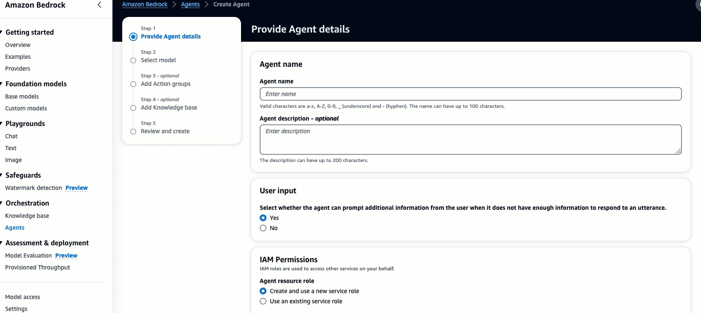
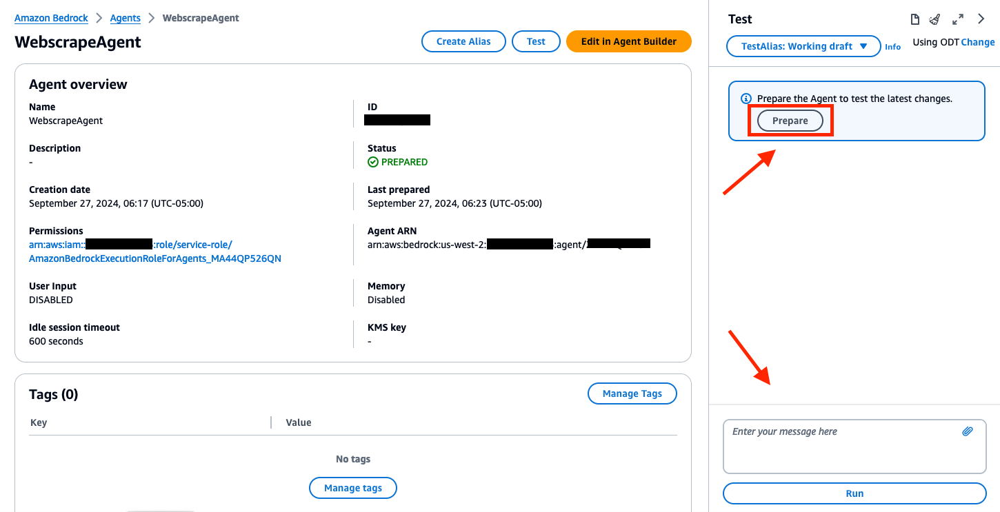
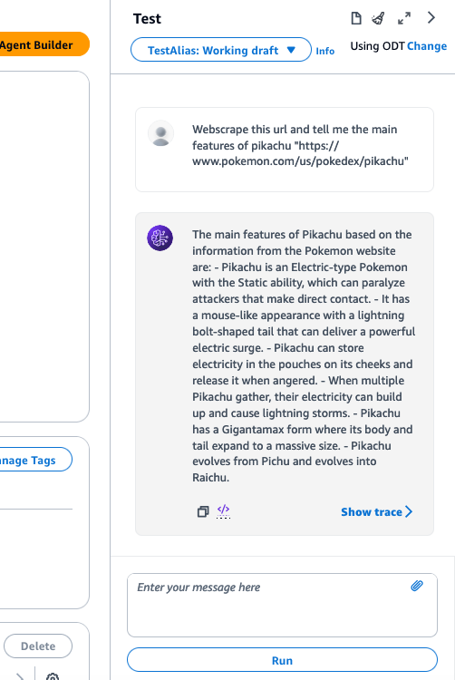
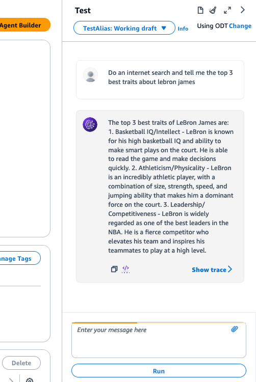

# Setup Amazon Bedrock Agent to Webscrape & Internet Search via Q&A

## Introduction
 We will setup an Amazon Bedrock agent with two action groups. This Bedrock agent will have the ability to webscrape a specific URL provided from the user prompt. You will also have the option to do an internet search to query something specific, without providing a URL. This setup will include creating a Bedrock agent, action group, S3 bucket, and a two Lambda functions.

## Prerequisites
- An active AWS Account.
- Familiarity with AWS services like Amazon Bedrock, S3, and Lambda.
- Access will need to be granted to the **Amazon Titan Embeddings G1 - Text** model, and **Anthropic Claude Instant** model from the Amazon Bedrock console.
  
## Library dependencies
- [requests](https://pypi.org/project/requests/)
- [googlesearch-python](https://pypi.org/project/googlesearch-python/)


## Diagram


## Configuration and Setup

### Step 1: Creating S3 Bucket

- **Artifacts & Lambda layer Bucket**: Create an S3 bucket to store artifacts. For example, call it `artifacts-bedrock-agent-webscrape-{alias}`.
  


Next, download and add the API schema files to this S3 bucket from [here](https://github.com/build-on-aws/bedrock-agents-webscraper/tree/main/schema). To do that, open a command prompt, and run these `curl` commands to download these files to your **Documents** folder:

For **Mac**
```linux
curl https://raw.githubusercontent.com/build-on-aws/bedrock-agents-webscraper/main/schema/internet-search-schema.json --output ~/Downloads/internet-search-schema.json

curl https://raw.githubusercontent.com/build-on-aws/bedrock-agents-webscraper/main/schema/webscrape-schema.json --output ~/Downloads/webscrape-schema.json
```

For **Windows**
```windows
curl https://raw.githubusercontent.com/build-on-aws/bedrock-agents-webscraper/main/schema/internet-search-schema.json --output %USERPROFILE%\Downloads\internet-search-schema.json

curl https://raw.githubusercontent.com/build-on-aws/bedrock-agents-webscraper/main/schema/webscrape-schema.json --output %USERPROFILE%\Downloads\webscrape-schema.json
```

- The provided schemas are an OpenAPI specification for the "Webscrape & Internet Search APIs," which outlines the structure required to call the respective functions via input and/or url. These API Schemas is a rich description of an action, so the agent knows when to use it, and exactly how to call it and use results. These schemas define primary endpoints, `/search` detailing how to interact with the API, the required parameter, and the expected responses. Make sure to open the .json documents to review the content.

- Next, download the .zip file for the lambda layer from [here](https://github.com/build-on-aws/bedrock-agents-webscraper/raw/main/lambda-layer/googlesearch_requests_libraries.zip), Once all of these files are downloaded, upload them to S3 bucket `artifacts-bedrock-agent-webscrape-{alias}`.


### Step 2: Lambda Function Configuration
- Create a Lambda function (Python 3.12) for the Bedrock agent's action group. We will call this Lambda function `bedrock-agent-webscrape`. 


 
- Copy the provided code from [here](https://github.com/build-on-aws/bedrock-agents-webscraper/blob/main/function/lambda_webscrape.py), or from below into the Lambda function.


```python
import requests
import os

# Fetch URL and extract text
def get_page_content(url):
    try:
        response = requests.get(url)
        if response.history:  # Check if there were any redirects
            print(f"Redirect detected for {url}")
            return None  # Return None to indicate a redirect occurred
        elif response:
            return response.text
        else:
            raise Exception("No response from the server.")
    except Exception as e:
        print(f"Error while fetching content from {url}: {e}")
        return None

def empty_tmp_folder():
    try:
        for filename in os.listdir('/tmp'):
            file_path = os.path.join('/tmp', filename)
            if os.path.isfile(file_path) or os.path.islink(file_path):
                os.unlink(file_path)
            elif os.path.isdir(file_path):
                shutil.rmtree(file_path)
        return "Temporary folder emptied."
    except Exception as e:
        print(f"Error while emptying /tmp folder: {e}")
        return None

def save_to_tmp(filename, content):
    try:
        if content is not None:
            with open(f'/tmp/{filename}', 'w') as file:
                file.write(content)
            return f"Saved {filename} to /tmp"
        else:
            raise Exception("No content to save.")
    except Exception as e:
        print(f"Error while saving {filename} to /tmp: {e}")
        return None

def check_tmp_for_data(query):
    try:
        data = []
        for filename in os.listdir('/tmp'):
            if query in filename:
                with open(f'/tmp/{filename}', 'r') as file:
                    data.append(file.read())
        return data if data else None
    except Exception as e:
        print(f"Error while checking /tmp for query {query}: {e}")
        return None

# Modify handle_search function to use tmp folder instead of S3
def handle_search(event):
    # Extract 'inputURL' from parameters
    parameters = event.get('parameters', [])
    input_url = next((param['value'] for param in parameters if param['name'] == 'inputURL'), '')

    if not input_url:
        return {"error": "No URL provided"}

    # Ensure URL starts with http:// or https://
    if not input_url.startswith(('http://', 'https://')):
        input_url = 'http://' + input_url

    # Check /tmp directory first
    tmp_data = check_tmp_for_data(input_url)
    if tmp_data:
        return {"results": tmp_data}

    # Empty the /tmp directory before saving new files
    empty_tmp_result = empty_tmp_folder()
    if empty_tmp_result is None:
        return {"error": "Failed to empty /tmp folder"}

    # Scrape content from the provided URL
    content = get_page_content(input_url)
    if content is None:
        return {"error": "Failed to retrieve content"}

    filename = input_url.split('//')[-1].replace('/', '_') + '.txt'
    save_result = save_to_tmp(filename, content)
    if save_result is None:
        return {"error": "Failed to save to /tmp"}

    return {"results": {'url': input_url, 'tmp_save_result': save_result}}

# Modify lambda_handler accordingly
def lambda_handler(event, context):
    response_code = 200
    action_group = event['actionGroup']
    api_path = event['apiPath']

    print("THE EVENT: ", event)
    
    if api_path == '/search':
        result = handle_search(event)
    else:
        response_code = 404
        result = f"Unrecognized api path: {action_group}::{api_path}"

    response_body = {
        'application/json': {
            'body': result
        }
    }

    action_response = {
        'actionGroup': event['actionGroup'], 
        'apiPath': event['apiPath'],
        'httpMethod': event['httpMethod'],
        'httpStatusCode': response_code,
        'responseBody': response_body
    }

    api_response = {'messageVersion': '1.0', 'response': action_response}
    print("RESPONSE: ", action_response)
    
    return api_response
```


- This above code takes the url from the event passed in from the bedrock agent, then uses the **requests** library to call, then scrape the webpage. The scraped data is saved to the `/tmp` directory of the Lambda function, then passed into the response back to the agent. Review the code, then **Deploy** the Lambda before moving to the next step.


- Next, apply a resource policy to the Lambda to grant Bedrock agent access. To do this, we will switch the top tab from **code** to **configuration** and the side tab to **Permissions**. Then, scroll to the **Resource-based policy statements** section and click the **Add permissions** button.


- Here is an example of the resource policy. (At this part of the setup, we will not have a Bedrock agent Source ARN. So, enter in `arn:aws:bedrock:us-west-2:{accoundID}:agent/BedrockAgentID` for now. We will include the ARN once it’s generated in step 4 after creating the Bedrock agent)


- Next, we will adjust the configuration on the Lambda so that it has enough time, and CPU to handle the request. Navigate back to the Lambda function screen, go to the Configurations tab, then General configuration and select Edit.


- Update Memory to 4048MB, Ephemeral storage to 1024MB, and Timeout to 1 minute. Leave the other settings as default, then select Save.


- You are now done setting up the webscrape Lambda function. Now, you will need to create another Lambda function following the exact same process for the **internet-search**. Name this Lambda function **bedrock-agent-internet-search**. Copy/paste the python code below for this Lambda, the **Deploy** the function after changes:

```python
import json
import requests
import os
import shutil
from googlesearch import search

def get_page_content(url):
    try:
        response = requests.get(url)
        if response:
            return response.text
        else:
            raise Exception("No response from the server.")
    except Exception as e:
        print(f"Error while fetching content from {url}: {e}")
        return None

def empty_tmp_directory():
    try:
        folder = '/tmp'
        for filename in os.listdir(folder):
            file_path = os.path.join(folder, filename)
            try:
                if os.path.isfile(file_path) or os.path.islink(file_path):
                    os.unlink(file_path)
                elif os.path.isdir(file_path):
                    shutil.rmtree(file_path)
            except Exception as e:
                print(f"Failed to delete {file_path}. Reason: {e}")
        print("Temporary directory emptied.")
    except Exception as e:
        print(f"Error while emptying /tmp directory: {e}")

def save_content_to_tmp(content, filename):
    try:
        if content is not None:
            with open(f'/tmp/{filename}', 'w', encoding='utf-8') as file:
                file.write(content)
            print(f"Saved {filename} to /tmp")
            return f"Saved {filename} to /tmp"
        else:
            raise Exception("No content to save.")
    except Exception as e:
        print(f"Error while saving {filename} to /tmp: {e}")

def search_google(query):
    try:
        search_results = []
        for j in search(query, sleep_interval=5, num_results=10):
            search_results.append(j)
        return search_results
    except Exception as e:
        print(f"Error during Google search: {e}")
        return []

def handle_search(event):
    input_text = event.get('inputText', '')  # Extract 'inputText'

    # Empty the /tmp directory before saving new files
    print("Emptying temporary directory...")
    empty_tmp_directory()

    # Proceed with Google search
    print("Performing Google search...")
    urls_to_scrape = search_google(input_text)

    aggregated_content = ""
    results = []
    for url in urls_to_scrape:
        print("URLs Used: ", url)
        content = get_page_content(url)
        if content:
            filename = url.split('//')[-1].replace('/', '_') + '.txt'  # Simple filename from URL
            aggregated_content += f"URL: {url}\n\n{content}\n\n{'='*100}\n\n"
            results.append({'url': url, 'status': 'Content aggregated'})
        else:
            results.append({'url': url, 'error': 'Failed to fetch content'})

    # Define a single filename for the aggregated content
    aggregated_filename = f"aggregated_{input_text.replace(' ', '_')}.txt"
    # Save the aggregated content to /tmp
    print("Saving aggregated content to /tmp...")
    save_result = save_content_to_tmp(aggregated_content, aggregated_filename)
    if save_result:
        results.append({'aggregated_file': aggregated_filename, 'tmp_save_result': save_result})
    else:
        results.append({'aggregated_file': aggregated_filename, 'error': 'Failed to save aggregated content to /tmp'})

    return {"results": results}

def lambda_handler(event, context):
    print("THE EVENT: ", event)
    
    response_code = 200
    if event.get('apiPath') == '/search':
        result = handle_search(event)
    else:
        response_code = 404
        result = {"error": "Unrecognized api path"}

    response_body = {
        'application/json': {
            'body': json.dumps(result)
        }
    }

    action_response = {
        'actionGroup': event['actionGroup'], 
        'apiPath': event['apiPath'],
        'httpMethod': event['httpMethod'],
        'httpStatusCode': response_code,
        'responseBody': response_body
    }

    api_response = {'messageVersion': '1.0', 'response': action_response}
    print("RESPONSE: ", action_response)
    
    return api_response
```


### Step 3: Create & attach Lambda layer

- In order to create this Lambda layer, you will need a .zip file of dependencies for the Lambda function that are not natively provided. We are using the **requests** and **googlesearrch** libraries for internet searching and web scraping. The dependencies are already packaged, and can be download from [here](https://github.com/build-on-aws/bedrock-agents-webscraper/raw/main/lambda-layer/googlesearch_requests_libraries.zip).  

- After, navigate to the AWS Lambda console, then select **layers** from the left-side panel, then create layer.
  

- Name your lambda layer `googlesearch_requests_layer`. Select **Upload a .zip file** and choose the .zip file of dependencies. Choose **x86_64** for your Compatible architectures, and Python 3.12 for your runtime (3.11 version is optional). Your choices should look similar to the example below.
  


- Navigate back to Lambda function `bedrock-agent-webscrape`, with **Code** tab selected. Scroll to the Layers section and select **Add a Layer**

- Choose the **Custom layers** option from the radio buttons, select the layer you created **googlesearch_requests_layer**, and version 1, then **Add**. Navigate back to your Lambda function, and verify that the layer has been added.


- You are now done creating and adding the dependencies needed via Lambda layer for your webscrape function. Now, add this same layer to the Lambda function `bedrock-agent-internet-search`, and verify that it has been added successfully.


### Step 4: Setup Bedrock Agent and Action Group 
- Navigate to the Bedrock console, go to the toggle on the left, and under **Orchestration** select **Agents**, then select **Create Agent**.


- On the next screen, provide an agent name, like "WebscrapeAgent". Leave the other options as default, then select **Next**.




- Select the **Anthropic: Claude Instant V1 model**. Now, we need to add instructions by creating a prompt that defines the rules of operation for the agent. In the prompt below, we provide specific instructions for the agent on how to answer questions. Copy, then paste the details below into the agent instructions. After, select **Next**.

   ```text
  You are a research analyst that webscrapes websites, and searches the internet to provide information based on a <question>. You provide concise answers in a friendly manner.
   ```


- Provide an action group name like "webscrape". Select the Lambda function `bedrock-agent-webscrape`. For the S3 Url, select the `schema webscrape-schema.json` file in the S3 bucket `artifacts-bedrock-agent-webscrape-alias`.


- After, select **Next**, then **Next** again as we are not adding a knowledge base. On the last screen, select **Create Agent**.

- You are now done setting up the webscrape action group. You will need to create another action group following the exact same process for the internet-search, using the schema [internet-search-schema.json](https://github.com/build-on-aws/bedrock-agents-webscraper/blob/main/schema/internet-search-schema.json) file.


### Step 5: Modify Bedrock Agent Advance Prompts
- Once your agent is created, we need to modify the advance prompts in the Bedrock agent for pre-processing so that the agent will allow us to use webscraping and internet searching. Navigate back to the Agent overview screen for your WebscrapeAgent, like below. 


- Scroll down, then select Working draft. Under Advanced prompts, select Edit.


- Your tab should already be on **Pre-processing**. Toggle on the **Override pre-processing template defaults** radio button. Also make sure the **Activate pre-processing template** radio button is on like below.

- Under *prompt template editor*, you will notice that you now have access to control the pre-built prompts. Scroll down to until you see "Category D". Replace this category section with the following:

   ```text
  -Category D: Questions that can be answered by webscrape or internet search, or assisted by our function calling agent using ONLY the functions it has been provided or arguments from within <conversation_history> or relevant arguments it can gather using the askuser function.
   ```

- After, scroll down and select **Save & Exit**.


## Step 5: Testing the Setup

### Testing the Bedrock Agent
- While on the Bedrock console, select **Agents** under the **Orchestration** tab, then the agent you created. Make sure to **Prepare** the agent so that the changes made can update. You will be able to enter prompts in the user interface to test your Bedrock agent action groups.




- Example prompts for **webscrape** action group:
  ```
   Webscrape this url and tell me the main features of pikachu "https://www.pokemon.com/us/pokedex/pikachu" 
  ```
  ```
  Webscrape this url and tell me the main villians that Goku had to fight on planet earth "https://en.wikipedia.org/wiki/Goku"
  ```
  ```
  Webscrape this url and tell me what you know about Romeo "https://www.gutenberg.org/cache/epub/1777/pg1777-images.html"
  ```




- Example prompts for **internet search** action group:
 ```
   Do an internet search and tell me the top 3 best traits about lebron james
 ```
 ```   
   Do an internet search and tell me how do I know what foods are healthy for me
 ```
 ```
   Do an internet search and tell me the top 3 strongest features of charizard from pokemon
 ```   



   (After executing the internet-search function, you can navigate to the CloudWatch logs for this Lambda function thats connected to the action group, and observe the URLs that the data was scraped from with details. You will notice that all URLs will not allow scraping, so the code is designed to error those attempts, and continue with the operation.)


- **PLEASE NOTE:** when using the **webscraper** and **internet-search** functionality, you could experience some level of hallucincation, innacuracies, or error if you attempt to ask about information that is very recent, if the prompt is too vague, or if the endpoint cannot be accessed or has a redirect. 

   There is also minimal control over which urls are selected during the internet search, except for the # of urls selected from within the google search function parameters. In order to help control this behavior, more engineering will need to be involved. 


## Cleanup
After completing the setup and testing of the Bedrock agent, follow these steps to clean up your AWS environment and avoid unnecessary charges:

1. Delete S3 Buckets:
- Navigate to the S3 console.
- Select the buckets "artifacts-bedrock-agent-webscrape-alias". Make sure that this bucket is empty by deleting the files. 
- Choose 'Delete' and confirm by entering the bucket name.

2.	Remove the Lambda Functions and Layers:
- Go to the Lambda console.
- Select the "bedrock-agent-internet-search" function.
- Click 'Delete' and confirm the action. Do the same for the webscraper function
- Be sure to navigate to the layers tab in the Lambda console, and delete "googlesearch_requests_layer"

3.	Delete Bedrock Agent:
- In the Bedrock console, navigate to 'Agents'.
- Select the created agent, then choose 'Delete'.


## Security

See [CONTRIBUTING](CONTRIBUTING.md#security-issue-notifications) for more information.

## License

This library is licensed under the MIT-0 License. See the LICENSE file.

